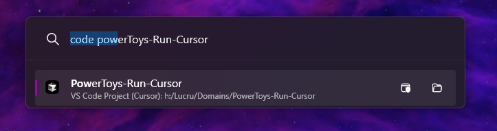
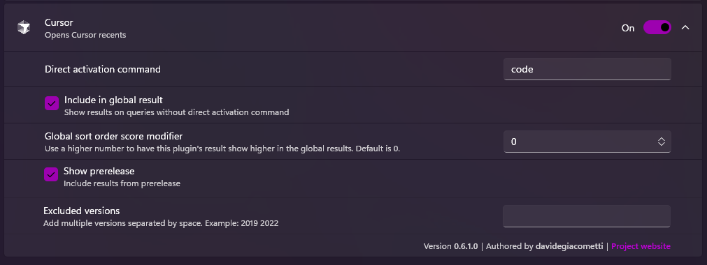

# PowerToys Run: Cursor AI Plugin

[](https://github.com/VictorNoxx/PowerToys-Run-Cursor/releases)
[](https://opensource.org/licenses/MIT)
[](https://github.com/microsoft/PowerToys)

**A powerful PowerToys Run plugin that enables quick access to Visual Studio and VSCode workspaces directly in Cursor AI editor.**

Open your recent projects, workspaces, and coding environments instantly with PowerToys Run launcher - no more hunting through folders or opening multiple applications to find your work.

## 🚀 Features

- **🎯 Quick Project Access**: Launch Visual Studio and VSCode workspaces directly in Cursor AI
- **📁 Recent Workspaces**: Access your most recently used projects and folders
- **🔍 Fast Search**: Type to instantly filter through your projects
- **⚡ Lightning Fast**: Integrated with PowerToys Run for optimal performance
- **🎨 Modern UI**: Clean, intuitive interface matching PowerToys design language
- **🌐 Cross-Platform Projects**: Support for local, WSL, SSH, and remote workspaces
- **🔧 Smart Detection**: Automatically detects project types and workspace configurations

## 📸 Screenshots


*Quick search through your recent workspaces*


*Easy plugin management in PowerToys settings*

## 🎯 Use Cases

- **Rapid Development**: Switch between projects without opening multiple editors
- **Workspace Management**: Organize and access your coding environments efficiently
- **Remote Development**: Quick access to WSL, SSH, and cloud-based workspaces
- **Project Discovery**: Find forgotten projects buried in your file system
- **Productivity Boost**: Reduce context switching and improve development workflow

## 📋 Requirements

- **Windows 10/11**: Compatible with modern Windows versions
- **PowerToys**: Minimum version 0.76.0 or higher
- **Cursor AI**: Latest version of Cursor AI editor
- **Visual Studio 2022**: For Visual Studio workspace support (optional)
- **VSCode**: For VSCode workspace support (optional)

## 🔧 Installation

### Method 1: Manual Installation
1. **Download**: Get the latest release for your architecture (`x64` or `ARM64`)
2. **Close PowerToys**: Ensure PowerToys is completely closed
3. **Extract**: Unzip the archive to `%LOCALAPPDATA%\Microsoft\PowerToys\PowerToys Run\Plugins`
4. **Restart**: Open PowerToys and the plugin will be automatically loaded

### Method 2: Package Manager (Coming Soon)
```bash
# Using PowerToys Run Plugin Manager (when available)
ptr add Cursor VictorNoxx/PowerToys-Run-Cursor
```

## 🚀 Usage

1. **Activate PowerToys Run**: Press `Win + R` or `Alt + Space`
2. **Search Projects**: Type your project name or workspace
3. **Select & Launch**: Choose your project and press `Enter`
4. **Enjoy**: Your project opens directly in Cursor AI

### Search Tips
- Type partial project names for quick filtering
- Use keywords like "recent", "workspace", or "project"
- Search by folder names or repository names

## ⚙️ Configuration

Access plugin settings through:
1. Open PowerToys Settings
2. Navigate to "PowerToys Run"
3. Find "Cursor AI Plugin" in the plugins list
4. Configure search behavior and display options

## 🌍 Localization

We support multiple languages to match PowerToys internationalization:
- English (Default)
- Spanish, French, German, Italian, Portuguese
- Chinese (Simplified & Traditional), Japanese, Korean
- Russian, Polish, Dutch, Swedish, Norwegian

### Contributing Translations
1. Fork this repository
2. Open `Community.PowerToys.Run.Plugin.Cursor.sln` in Visual Studio
3. Navigate to `Community.PowerToys.Run.Plugin.Cursor\Properties`
4. Update existing `.resx` files or create new ones (e.g., `Resources.it-IT.resx`)
5. Submit a pull request

## 🙏 Attribution & Inspiration

This plugin is inspired by and built upon the excellent work of:

- **Original Feature Request**: [Microsoft PowerToys Issue #3547](https://github.com/microsoft/PowerToys/issues/3547) - VSCode opened workspaces plugin request by [@ricardosantos9521](https://github.com/ricardosantos9521)
- **Visual Studio Plugin**: [PowerToys-Run-VisualStudio](https://github.com/davidegiacometti/PowerToys-Run-VisualStudio) by [@davidegiacometti](https://github.com/davidegiacometti)

Special thanks to the PowerToys community and contributors who made this possible.

## 🛠️ Technical Details

### Architecture
- **Plugin Framework**: Built on PowerToys Run plugin architecture
- **Detection Method**: Uses `vswhere.exe` for Visual Studio instances
- **Workspace Discovery**: Parses configuration files and recent project lists
- **Integration**: Direct command-line integration with Cursor AI

### Supported Workspace Types
- Visual Studio Solutions (`.sln`)
- VSCode Workspaces (`.code-workspace`)
- Folder-based projects
- Git repositories
- Remote workspaces (WSL, SSH, Containers)

## 🐛 Troubleshooting

### Common Issues
- **Plugin not appearing**: Ensure PowerToys is restarted after installation
- **No workspaces found**: Check that Visual Studio/VSCode have been used recently
- **Cursor not opening**: Verify Cursor AI is installed and in PATH

### Debug Information
Enable debug logging in PowerToys settings for detailed troubleshooting information.

## 🤝 Contributing

We welcome contributions! Please see our [Contributing Guidelines](CONTRIBUTING.md) for details.

1. Fork the repository
2. Create a feature branch
3. Make your changes
4. Add tests if applicable
5. Submit a pull request

## 👥 Contributors

- [@VictorNoxx](https://github.com/VictorNoxx) - Project maintainer
- [@artickc](https://github.com/artickc) - Core contributor
- NOXX Agency - Copyright holder

## 📝 License

This project is licensed under the MIT License - see the [LICENSE](LICENSE) file for details.

## 🏷️ Keywords

`powertoys` `powertoys-run` `powertoys-plugin` `cursor-ai` `visual-studio` `vscode` `workspace-manager` `project-launcher` `developer-tools` `productivity` `windows` `dotnet` `csharp` `plugin-development` `launcher` `quick-access` `development-environment` `code-editor` `workspace` `recent-projects`

---

⭐ **Star this repository** if you find it useful!

🐛 **Report issues** on our [GitHub Issues](https://github.com/VictorNoxx/PowerToys-Run-Cursor/issues) page

💬 **Join the discussion** in our [GitHub Discussions](https://github.com/VictorNoxx/PowerToys-Run-Cursor/discussions)
